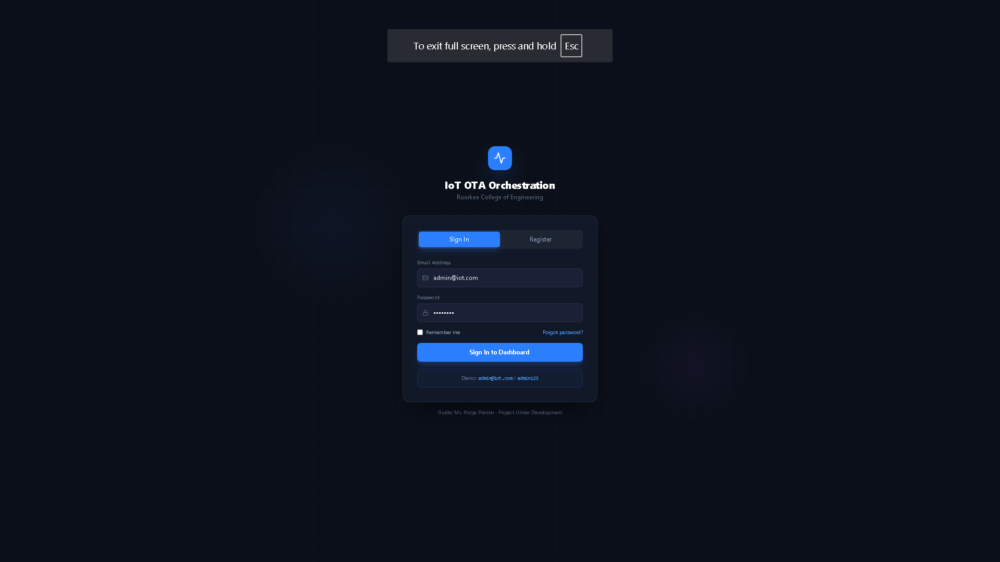
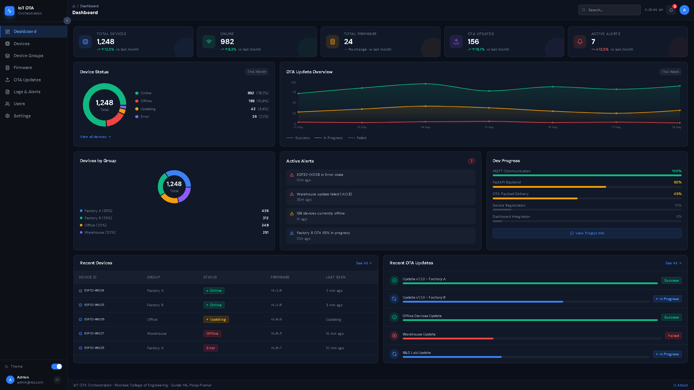
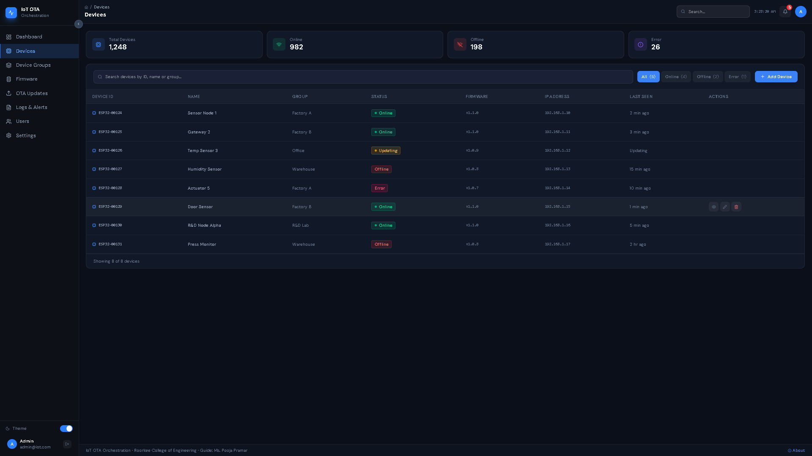
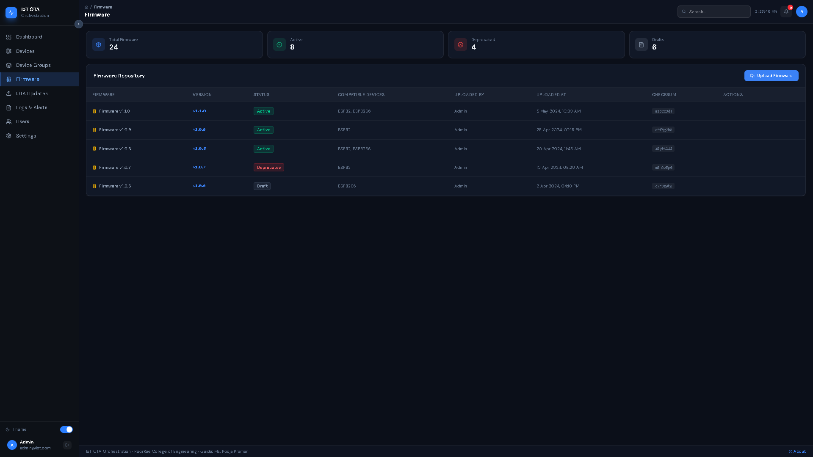
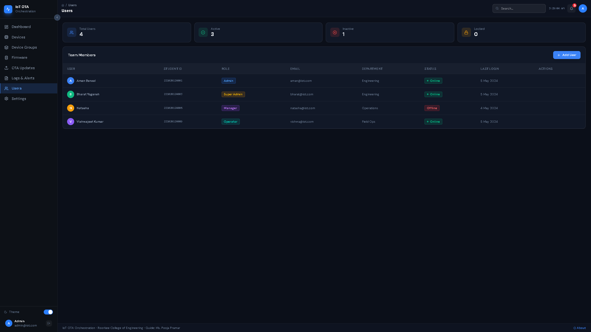
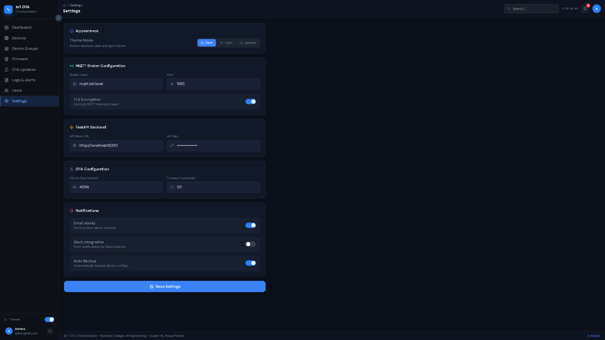

# IoT Device Management & OTA Orchestration System

A centralized, scalable, and secure platform for managing IoT device fleets and orchestrating Over-The-Air (OTA) firmware updates.

## Features

* Device Registration & Management
* Secure OTA Firmware Updates
* MQTT-Based Real-Time Communication
* Device Group Management
* Firmware Repository
* JWT Authentication
* Role-Based Access Control (RBAC)
* SHA-256 Firmware Verification
* Real-Time Dashboard Monitoring
* Dockerized Deployment

## Tech Stack

### Frontend

* React.js
* Vite
* Tailwind CSS

### Backend

* FastAPI
* Python

### Communication

* MQTT
* Eclipse Mosquitto

### Databases

* PostgreSQL
* MongoDB

### Hardware

* ESP32

### DevOps

* Docker
* Docker Compose

## Architecture

The system follows a four-tier architecture:

1. ESP32 Edge Devices
2. MQTT Communication Layer
3. FastAPI Application Layer
4. PostgreSQL + MongoDB Persistence Layer

## Security Features

* TLS Encrypted MQTT Communication
* JWT Authentication
* RBAC Authorization
* SHA-256 Firmware Integrity Verification
* Audit Logging

## Future Enhancements

* AI-Based Device Anomaly Detection
* Delta OTA Updates
* CI/CD Integration
* Kubernetes Deployment

## Application Screenshots

### Login Page

### Dashboard

### Devices

### Device Groups

### Firmware Management

### OTA Updates

### Logs & Alerts

### User Management

### Settings

